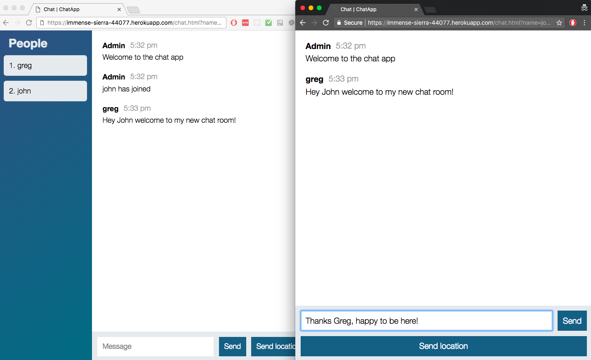

# node-chat-app

Node.js and Socket.io Chat app based on the tutorial for [The Complete Node.js Developer Course](https://www.udemy.com/the-complete-nodejs-developer-course-2) on Udemy.
Currently viewable at this [Heroku link](https://immense-sierra-44077.herokuapp.com/).

## Live testing

1. Click [this link](https://immense-sierra-44077.herokuapp.com/)
1. Create a user name and room
1. In another browswer or on another device, create another user name and join the same room
1. Have fun chatting with yourself!

## Future ideas

- Make room names case insensitive
- Make user names unique
- Add a list of currently active chat rooms
- Some styling like [this one](https://socket-io-chat-webapp.herokuapp.com/) and here's [the repository](https://github.com/Babazon/nodejs_socketio_chatwebapp)
- Add [encryption](https://www.udemy.com/the-complete-nodejs-developer-course-2/learn/v4/questions/2119462)
- [Prevent join/leave spam](https://www.udemy.com/the-complete-nodejs-developer-course-2/learn/v4/questions/2520318)
- Add current users count for the login page and the selection list
- [Add authentication](https://www.udemy.com/the-complete-nodejs-developer-course-2/learn/v4/questions/2534768) and [read this](https://auth0.com/blog/auth-with-socket-io/)
- If browser tab is not active, flash the tab and show unread message count as in [this example](https://www.google.ca/search?q=javascript+detect+if+tab+is+active&oq=js+detect+if+ta&aqs=chrome.1.69i57j0l5.12357j0j7&sourceid=chrome&ie=UTF-8)
